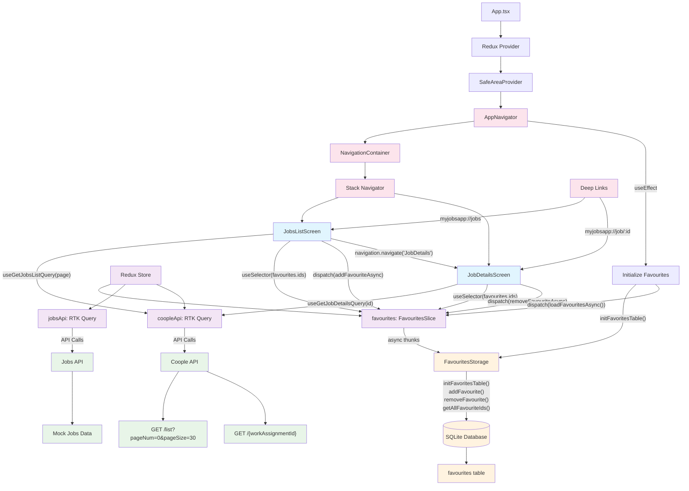

# MyJobsApp 🚀

Modern React Native application for job searching with favourites functionality and local data persistence.

## 📝 Description

MyJobsApp is a comprehensive job listing application built with React Native and Expo. The app features job search, detailed job views, favourites management with SQLite persistence, and deep linking support. It demonstrates modern mobile development practices using Redux Toolkit, RTK Query, and TypeScript.

### ✨ Key Features

- 📋 **Job Listings** - Browse jobs with pagination from Coople API
- 🔍 **Job Details** - View detailed job information
- ⭐ **Favourites System** - Save jobs locally with SQLite database
- 🔗 **Deep Linking** - Direct navigation via custom URLs (`myjobsapp://job/123`)
- 📱 **Modern UI** - Clean, responsive design with React Native
- 🔄 **State Management** - Redux Toolkit with async thunks
- 💾 **Local Storage** - SQLite database for offline favourites
- 🎯 **TypeScript** - Full type safety throughout the app

## 🛠️ Tech Stack

- **React Native** with Expo
- **TypeScript** for type safety
- **Redux Toolkit** + RTK Query for state management
- **React Navigation** for navigation and deep linking
- **expo-sqlite** for local database
- **React Native Safe Area Context** for device compatibility

## 📦 Installation

### Prerequisites
- Node.js (v16 or higher)
- npm or yarn
- Expo CLI (`npm install -g @expo/cli`)
- Expo Go app on your mobile device (for testing)

### Setup

1. **Clone the repository**
   ```bash
   git clone <repository-url>
   cd new
   ```

2. **Install dependencies**
   ```bash
   npm install
   # or
   yarn install
   ```

3. **Start the development server**
   ```bash
   npx expo start
   # or
   npm start
   ```

4. **Run on device/simulator**
   - Scan QR code with Expo Go app (iOS/Android)
   - Press `i` for iOS simulator
   - Press `a` for Android emulator
   - Press `w` for web browser

## 🚀 Getting Started

### First Run
1. Launch the app
2. The SQLite database will be initialized automatically
3. Browse job listings from the Coople API
4. Tap ⭐ to add jobs to favourites
5. Tap on any job card to view details

### Deep Linking
Access specific jobs directly via URLs:
- `myjobsapp://jobs` - Open job listings
- `myjobsapp://job/123` - Open specific job details

## 📱 Usage

### Job Listings Screen
- **Browse Jobs**: Scroll through available positions
- **Load More**: Tap "Load More" button for pagination
- **Add to Favourites**: Tap ⭐ icon to save jobs locally
- **View Details**: Tap on job card to see full information
- **Pull to Refresh**: Pull down to refresh the job list

### Job Details Screen
- **Complete Information**: View all job details dynamically
- **Toggle Favourites**: Use ⭐ button or bottom action button
- **Auto-formatting**: All API fields displayed with smart formatting

### Favourites Management
- Favourites are automatically saved to SQLite database
- Sync across app sessions
- Real-time UI updates when adding/removing favourites

## 🏗️ Architecture

The application follows a modern React Native architecture with Redux Toolkit for state management and SQLite for local persistence.



### 🏛️ Architecture Components

#### **Presentation Layer**
- `src/features/jobs/JobsListScreen.tsx` - Job listings with pagination
- `src/features/jobDetails/JobDetailsScreen.tsx` - Detailed job view
- `src/shared/navigation/AppNavigator.tsx` - Navigation configuration

#### **State Management Layer**
- `src/shared/store.ts` - Redux store configuration
- `src/features/favourites/favouritesSlice.ts` - Favourites state with async thunks
- `src/shared/api/coopleApi.ts` - RTK Query API definitions

#### **Data Access Layer**
- `src/features/favourites/favouritesStorage.ts` - SQLite database operations
- External APIs via RTK Query for job data

#### **Navigation & Deep Linking**
- React Navigation v6 with native stack
- Custom URL scheme: `myjobsapp://`
- Type-safe navigation parameters

## 📂 Project Structure

```
src/
├── app/
│   └── index.tsx                 # App entry point
├── features/
│   ├── favourites/
│   │   ├── favouritesSlice.ts    # Redux slice with async thunks
│   │   ├── favouritesStorage.ts  # SQLite operations
│   │   └── hooks.ts              # Custom React hooks
│   ├── jobs/
│   │   ├── JobsListScreen.tsx    # Job listings component
│   │   ├── api.ts                # Jobs API (legacy)
│   │   └── hooks.ts              # Job-related hooks
│   └── jobDetails/
│       ├── JobDetailsScreen.tsx  # Job details component
│       └── api.ts                # Job details API
├── shared/
│   ├── api/
│   │   └── coopleApi.ts          # Coople API integration
│   ├── navigation/
│   │   └── AppNavigator.tsx      # Navigation setup
│   └── store.ts                  # Redux store configuration
└── index.ts                      # Main entry point
```

## 🧪 Development

### Available Scripts
- `npm start` - Start Expo development server
- `npm run android` - Run on Android device/emulator
- `npm run ios` - Run on iOS device/simulator
- `npm run web` - Run in web browser

### Database Schema
```sql
CREATE TABLE IF NOT EXISTS favourites (
  id TEXT PRIMARY KEY
);
```

### Environment Setup
No additional environment configuration required. The app uses:
- Coople API: `https://www.coople.com/ch/resources/api/work-assignments/public-jobs/`
- SQLite database: Created automatically on first run

## 🔧 Configuration

### Deep Linking Setup
The app is configured with custom URL scheme `myjobsapp://`:
- `myjobsapp://jobs` → JobsListScreen
- `myjobsapp://job/:id` → JobDetailsScreen with specific job

### API Configuration
- **Base URL**: `https://www.coople.com/ch/resources/api/work-assignments/public-jobs/`
- **Endpoints**:
  - `GET /list?pageNum={page}&pageSize=30` - Job listings
  - `GET /{workAssignmentId}` - Job details

## 📱 Supported Platforms

- ✅ iOS (via Expo Go or development build)
- ✅ Android (via Expo Go or development build)  
- ✅ Web (experimental support)

## 🤝 Contributing

1. Fork the repository
2. Create a feature branch (`git checkout -b feature/amazing-feature`)
3. Commit your changes (`git commit -m 'Add amazing feature'`)
4. Push to the branch (`git push origin feature/amazing-feature`)
5. Open a Pull Request

## 📄 License

This project is licensed under the MIT License - see the [LICENSE](LICENSE) file for details.

## 🙋‍♂️ Support

For support, please open an issue in the repository or contact the development team.

---

Built with ❤️ using React Native and Expo 