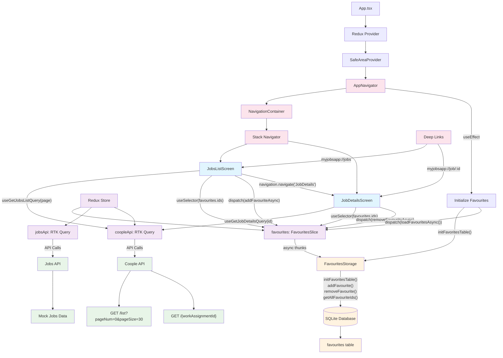
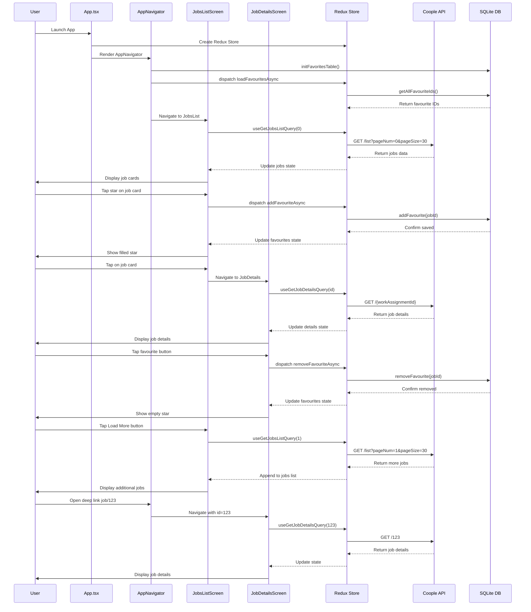

# Архитектура приложения - Диаграммы

## 1. Архитектура системы (Flowchart)

## 2. Пользовательские сценарии (Sequence Diagram)

## Описание компонентов

### 🎯 Основные экраны:
- **JobsListScreen** - список вакансий с пагинацией и избранным
- **JobDetailsScreen** - детали вакансии с возможностью добавления в избранное

### 🗄️ Управление состоянием:
- **Redux Store** - централизованное хранилище состояния
- **FavouritesSlice** - управление избранными вакансиями
- **RTK Query APIs** - кэширование и управление API запросами

### 💾 Хранение данных:
- **SQLite Database** - локальное хранение избранного
- **Coople API** - внешний источник данных вакансий

### 🔗 Навигация:
- **React Navigation** - маршрутизация между экранами
- **Deep Linking** - прямые ссылки на конкретные вакансии

### 🎨 Цветовая схема:
- 🔵 Экраны (UI компоненты)
- 🟣 Redux (управление состоянием) 
- 🟢 API (внешние данные)
- 🟠 База данных (локальные данные)
- 🔴 Навигация (маршрутизация) 